## [Client Builder for ProductionbeaconNode](../beacon_node/src/lib.rs)
- `initialize node`

```rust
/// A type-alias to the tighten the definition of a production-intended `Client`.
pub type ProductionClient<E> =
    Client<Witness<SystemTimeSlotClock, E, BeaconNodeBackend, BeaconNodeBackend>>;

/// The beacon node `Client` that is used in production.
///
/// Generic over some `EthSpec`.
pub struct ProductionBeaconNode<E: EthSpec>(ProductionClient<E>);

impl<E: EthSpec> ProductionBeaconNode<E> {
    /// Starts a new beacon node `Client` in the given `environment`.
    ///
    /// Identical to `start_from_client_config`, however the `client_config` is generated from the
    /// given `matches` and potentially configuration files on the local filesystem or other
    /// configurations hosted remotely.
    pub async fn new_from_cli(
        context: RuntimeContext<E>,
        matches: ArgMatches,
    ) -> Result<Self, String> {
        let client_config = get_config::<E>(&matches, &context)?;
        Self::new(context, client_config).await
    }
    /// Starts a new beacon node `Client` in the given `environment`.
   
    ///
    /// Client behaviour is defined by the given `client_config`.
    pub async fn new(
        context: RuntimeContext<E>,
        mut client_config: ClientConfig,
    ) -> Result<Self, String> {
        let spec: Arc<ChainSpec> = context.eth2_config().spec.clone();
        let client_genesis = client_config.genesis.clone();
        let store_config: StoreConfig = client_config.store.clone();
        let _datadir: PathBuf = client_config.create_data_dir()?;
        let db_path: PathBuf = client_config.create_db_path()?;
        let freezer_db_path: PathBuf = client_config.create_freezer_db_path()?;
        let blobs_db_path: PathBuf = client_config.create_blobs_db_path()?;
        let executor: TaskExecutor = context.executor.clone();

        if let Some(legacy_dir) = client_config.get_existing_legacy_data_dir() {
            ...
        }

        if let Err(misaligned_forks) = validator_fork_epochs(&spec) {
            ...
        }

        let builder = ClientBuilder::new(context.eth_spec_instance.clone())
            .runtime_context(context)
            .chain_spec(spec.clone())
            .beacon_processor(config: client_config.beacon_processor.clone())
            .http_api_config(client_config.http_api.clone())
            .disk_store(db_path: &db_path, cold_path: &freezer_db_path, blobs_path: &blobs_db_path, store_config)?;

        let builder = if let Some(mut slasher_config) = client_config.slasher.clone() {
            ...
        } else {
            ...
        };

        let builder = if let Some(monitoring_config) = &mut client_config.monitoring_api {
            ...
        } else {
            ...
        };

        // Generate or load the node id.
        let local_keypair: Keypair = load_private_key(&client_config.network);
        let node_id: [u8; 32] = peer_id_to_node_id(&local_keypair.public().to_peer_id())?.raw();

        let builder = builder
            .beacon_chain_builder(client_genesis, client_config.clone(), node_id)
            .await?;
        info!("Block production enabled");

        let builder = builder.system_time_slot_clock()?;

        // Inject the executor into the discv5 network config.
        let discv5_executor = Discv5Executor(executor);
        client_config.network.discv5_config.executor = Some(Box::new(discv5_executor));
        
        builder
            .build_beacon_chain()?
            .network(Arc::new(client_config.network), local_keypair)
            .await?
            .notifier()?
            .http_metrics_config(client_config.http_metrics.clone())
            .build()
            .await
            .map(Self)
    }
```

- `Client Builder`
```rust
    /// Starts the networking stack.
    pub async fn network(
        mut self,
        config: Arc<NetworkConfig>,
        local_keypair: Keypair,
    ) -> Result<Self, String> {
        let beacon_chain = self
            .beacon_chain
            .clone()
            .ok_or("network requires a beacon chain")?;
        let context = self
            .runtime_context
            .as_ref()
            .ok_or("network requires a runtime_context")?
            .clone();
        let beacon_processor_channels = self
            .beacon_processor_channels
            .as_ref()
            .ok_or("network requires beacon_processor_channels")?;

        // If gossipsub metrics are required we build a registry to record them
        let mut libp2p_registry = if config.metrics_enabled {
            Some(Registry::default())
        } else {
            None
        };

        let (network_globals, network_senders) = NetworkService::start(
            beacon_chain.clone(),
            config,
            context.executor,
            libp2p_registry.as_mut(),
            beacon_processor_channels.beacon_processor_tx.clone(),
            local_keypair,
        )
        .await
        .map_err(|e| format!("Failed to start network: {:?}", e))?;

        self.network_globals = Some(network_globals);
        self.network_senders = Some(network_senders);
        self.libp2p_registry = libp2p_registry;

        Ok(self)
    }
```

```rust
/// Consumes the builder, returning a `Client` if all necessary components have been
/// specified.
///
/// If type inference errors are being raised, see the comment on the definition of `Self`.
#[allow(clippy::type_complexity)]
#[instrument(name = "build_client", skip_all)]
pub async fn build(
    mut self,
) -> Result<Client<Witness<SlotClock, E, THotStore, TColdStore>>, String> {
    let runtime_context = self
        .runtime_context
        .as_ref()
        .ok_or("build requires a runtime context")?;

    let beacon_processor_channels = self
        .beacon_processor_channels
        .take()
        .ok_or("build requires beacon_processor_channels")?;

    let beacon_processor_config = self
        .beacon_processor_config
        .take()
        .ok_or("build requires a beacon_processor_config")?;

    let http_api_listen_addr = if self.http_api_config.enabled {
        let ctx = Arc::new(http_api::Context {
            config: self.http_api_config.clone(),
            chain: self.beacon_chain.clone(),
            network_senders: self.network_senders.clone(),
            network_globals: self.network_globals.clone(),
            beacon_processor_send: Some(beacon_processor_channels.beacon_processor_tx.clone()),
            sse_logging_components: runtime_context.sse_logging_components.clone(),
            historical_committee_cache: Arc::new(http_api::HistoricalCommitteeCache::new(
                ...
            )),
        });

        let exit = runtime_context.executor.exit();

        let (listen_addr, server) = http_api::serve(ctx, exit)
            .await
            .map_err(|e| format!("Unable to start HTTP API server: {:?}", e))?;

        let http_api_task = async move {
            server.await;
            debug!("HTTP API server task ended");
        };

        runtime_context
            .clone()
            .executor
            .spawn_without_exit(http_api_task, "http-api");

        Some(listen_addr)
    } else {
        ...
    };

    let http_metrics_listen_addr = if self.http_metrics_config.enabled {
        ...
    } else {
        ...
    };

    if self.slasher.is_some() {
        self.start_slasher_service()?;
    }

    if let Some(beacon_chain) = self.beacon_chain.as_ref() {
        if let Some(network_globals) = &self.network_globals {
            let beacon_processor_context = runtime_context.clone();
            BeaconProcessor {
                network_globals: network_globals.clone(),
                executor: beacon_processor_context.executor.clone(),
                current_workers: 0,
                config: beacon_processor_config,
            }
            .spawn_manager(
                beacon_processor_channels.beacon_processor_rx,
                None,
                beacon_chain.slot_clock.clone(),
                beacon_chain.spec.maximum_gossip_clock_disparity(),
                BeaconProcessorQueueLengths::from_state(
                    ...
                )?,
            )?;
        }

        let state_advance_context = runtime_context.clone();
        spawn_state_advance_timer(state_advance_context.executor, beacon_chain.clone());

        if let Some(execution_layer) = beacon_chain.execution_layer.as_ref() {
            ...
        }

        // Spawn service to publish light client updates at some interval into the slot.
        if let Some(light_client_server_rx) = self.light_client_server_rx {
            let inner_chain = beacon_chain.clone();
            let light_client_update_context = runtime_context.clone();
            light_client_update_context.executor.spawn(
                async move {
                    compute_light_client_updates(
                        &inner_chain,
                        light_client_server_rx,
                        beacon_processor_channels.beacon_processor_tx,
                    )
                    .await
                },
                "lc_update",
            );
        }

        start_proposer_prep_service(runtime_context.executor.clone(), beacon_chain.clone());
        start_availability_cache_maintenance_service(
            ...
        );
        start_engine_version_cache_refresh_service(
            ...
        );
        start_attestation_simulator_service(
            ...
        );
    }

    Ok(Client {
        beacon_chain: self.beacon_chain,
        network_globals: self.network_globals,
        http_api_listen_addr,
        http_metrics_listen_addr,
    })
}
```
## [beacon_node/network/src/service.rs](../beacon_node/network/src/service.rs)
- [pub async fn start()](../beacon_node/network/src/service.rs#374)
```rust
    #[allow(clippy::type_complexity)]
    pub async fn start(
        beacon_chain: Arc<BeaconChain<T>>,
        config: Arc<NetworkConfig>,
        executor: task_executor::TaskExecutor,
        libp2p_registry: Option<&'_ mut Registry>,
        beacon_processor_send: BeaconProcessorSend<T::EthSpec>,
        local_keypair: Keypair,
    ) -> Result<(Arc<NetworkGlobals<T::EthSpec>>, NetworkSenders<T::EthSpec>), String> {
        let (network_service, network_globals, network_senders) = Self::build(
            beacon_chain,
            config,
            executor.clone(),
            libp2p_registry,
            beacon_processor_send,
            local_keypair,
        )
        .await?;

        network_service.spawn_service(executor);

        Ok((network_globals, network_senders))
    }
```

- [async fn build()](../beacon_node/network/src/service.rs#222)
```rust
async fn build(
    beacon_chain: Arc<BeaconChain<T>>,
    config: Arc<NetworkConfig>,
    executor: task_executor::TaskExecutor,
    libp2p_registry: Option<&'_ mut Registry>,
    beacon_processor_send: BeaconProcessorSend<T::EthSpec>,
    local_keypair: Keypair,
) -> Result<
    (
        NetworkService<T>,
        Arc<NetworkGlobals<T::EthSpec>>,
        NetworkSenders<T::EthSpec>,
    ),
    String,
> {
    // build the channels for external comms
    let (network_senders, network_receivers) = NetworkSenders::new();

    #[cfg(feature = "disable-backfill")]
    warn!("Backfill is disabled. DO NOT RUN IN PRODUCTION");

    if let (true, false, Some(v4)) = (
        config.upnp_enabled,
        config.disable_discovery,
        config.listen_addrs().v4(),
    ) {
        ...
    }

    // get a reference to the beacon chain store
    let store = beacon_chain.store.clone();

    // build the current enr_fork_id for adding to our local ENR
    let enr_fork_id: EnrForkId = beacon_chain.enr_fork_id();

    // keep track of when our fork id needs to be updated
    let next_digest_update = Box::pin(next_digest_delay(&beacon_chain).into());
    // topics change when the fork digest changes
    let next_topic_subscriptions =
        Box::pin(next_topic_subscriptions_delay(&beacon_chain).into());
    let next_unsubscribe = Box::pin(None.into());

    let current_slot: Slot = beacon_chain
        .slot()
        .unwrap_or_default(beacon_chain.spec.genesis_slot);

    // Create a fork context for the given config and genesis validators root
    let fork_context: Arc<ForkContext> = Arc::new(ForkContext::new::<T::EthSpec>(
        ...
    ));

    // construct the libp2p service context
    let service_context: Context<'_> = Context {
        ...
    };

    // launch libp2p service
    let (mut libp2p, network_globals) = Network::new(
        executor.clone(),
        service_context,
        beacon_chain.custody_context.custody_group_count_at_head(),
        local_keypair,
    )
    .await?;

    // Repopulate the DHT with stored ENR's if discovery is not disabled.
    if !config.disable_discovery {
        ...
    }

    let invalid_block_storage: InvalidBlockStorage = config
        .invalid_block_storage
        .clone()
        .map(InvalidBlockStorage::Enabled)
        .unwrap_or_default();

    // launch derived network services

    // router task
    let router_send = Router::spawn(
        beacon_chain.clone(),
        network_globals.clone(),
        network_senders.network_send(),
        executor.clone(),
        invalid_block_storage,
        beacon_processor_send,
        fork_context.clone(),
    )?;

    // attestation and sync committee subnet service
    let subnet_service = SubnetService::new(
        ...
    );

    // create a timer for updating network metrics
    let metrics_update = tokio::time::interval(Duration::from_secs(METRIC_UPDATE_INTERVAL));

    // create a timer for updating gossipsub parameters
    let gossipsub_parameter_update = tokio::time::interval(Duration::from_secs(60));

    let NetworkReceivers {
        network_recv,
        validator_subscription_recv,
    } = network_receivers;

    // create the network service and spawn the task
    let network_service = NetworkService {
        beacon_chain,
        libp2p,
        subnet_service,
        network_recv,
        validator_subscription_recv,
        router_send,
        store,
        network_globals: network_globals.clone(),
        next_digest_update,
        next_topic_subscriptions,
        next_unsubscribe,
        shutdown_after_sync: config.shutdown_after_sync,
        metrics_enabled: config.metrics_enabled,
        metrics_update,
        gossipsub_parameter_update,
        fork_context,
    };

    Ok((network_service, network_globals, network_senders))
}
```

- [NetworkServer handle Request and Response](../beacon_node/network/src/service.rs#427)
```rust
fn send_to_router(&mut self, msg: RouterMessage<T::EthSpec>) {
    if let Err(mpsc::error::SendError(msg)) = self.router_send.send(msg) {
        debug!(?msg, "Failed to send msg to router");
    }
}

fn spawn_service(mut self, executor: task_executor::TaskExecutor) {
    let mut shutdown_sender = executor.shutdown_sender();

    // spawn on the current executor
    let service_fut = async move {
        loop {
            tokio::select! {
                _ = self.metrics_update.tick(), if self.metrics_enabled => {
                    ...
                }

                _ = self.gossipsub_parameter_update.tick() => self.update_gossipsub_parameters(),

                // handle a message sent to the network
                Some(msg) = self.network_recv.recv() => self.on_network_msg(msg, &mut shutdown_sender).await,

                // handle a message from a validator requesting a subscription to a subnet
                Some(msg) = self.validator_subscription_recv.recv() => self.on_validator_subscription_msg(msg).await,

                // process any subnet service events
                Some(msg) = self.subnet_service.next() => self.on_subnet_service_msg(msg),

                event = self.libp2p.next_event() => self.on_libp2p_event(event, &mut shutdown_sender).await,

                Some(_) = &mut self.next_digest_update => self.update_next_fork_digest(),

                Some(_) = &mut self.next_unsubscribe => {
                    let new_enr_fork_id = self.beacon_chain.enr_fork_id();
                    self.libp2p.unsubscribe_from_fork_topics_except(new_enr_fork_id.fork_digest);
                    info!("Unsubscribed from old fork topics");
                    self.next_unsubscribe = Box::pin(None.into());
                }

                Some(_) = &mut self.next_topic_subscriptions => {
                    ...
                }
            } // tokio::select!
        }
    };

    executor.spawn(service_fut, "network");
}
```
```rust
/// Handle an event received from the network.
async fn on_libp2p_event(
    &mut self,
    ev: NetworkEvent<T::EthSpec>,
    shutdown_sender: &mut Sender<ShutdownReason>,
) {
    match ev {
        NetworkEvent::PeerConnectedOutgoing(peer_id) => {
            ...
        }
        NetworkEvent::PeerConnectedIncoming(_) => {
            ...
        }
        NetworkEvent::PeerDisconnected(peer_id) => {
            ...
        }
        NetworkEvent::PeerUpdatedCustodyGroupCount(peer_id) => {
            ...
        }
        NetworkEvent::RequestReceived {
            peer_id,
            inbound_request_id,
            request_type,
        } => {
            self.send_to_router(RouterMessage::RPCRequestReceived {
                peer_id,
                inbound_request_id,
                request_type,
            });
        }
        NetworkEvent::ResponseReceived {
            ...
        } => {
            ...
        }
        NetworkEvent::RPCFailed {
            ...
        } => {
            ...
        }
        NetworkEvent::StatusPeer(peer_id) => {
            ...
        }
        NetworkEvent::PubsubMessage {
            ...
        } => {
            ...
        }
        NetworkEvent::PartialDataColumnSidecar {
            ...
        } => {
            ...
        }
        NetworkEvent::NewListenAddr(multiaddr) => {
            ...
        }
        NetworkEvent::ZeroListeners => {
            ...
        }
    }
}
```
```rust
/// Handle a message sent to the network service.
async fn on_network_msg(
    &mut self,
    msg: NetworkMessage<T::EthSpec>,
    shutdown_sender: &mut Sender<ShutdownReason>,
) {
    metrics::inc_counter_vec(&metrics::NETWORK_RECEIVE_EVENTS, &[(&msg).into()]);
    let _timer = metrics::start_timer_vec(&metrics::NETWORK_RECEIVE_TIMES, &[(&msg).into()]);

    match msg {
        NetworkMessage::SendRequest {
            ...
        } => {
            if let Err((app_request_id, error)) =
                self.libp2p.send_request(peer_id, app_request_id, request)
            {
                ...
            }
        }
        NetworkMessage::SendResponse {
            ...
        } => {
            ...
        }
        NetworkMessage::SendErrorResponse {
            ...
        } => self.libp2p.send_response(
            ...
        ),
        NetworkMessage::ValidationResult {
            ...
        } => {
            ...
        }
        NetworkMessage::PartialValidationFailure {
            ...
        } => {
            ...
        }
        NetworkMessage::Publish { messages } => {
            ...
        }
        NetworkMessage::PublishPartialColumns { messages } => {
            ...
        }
        NetworkMessage::ReportPeer {
            ...
        } => self.libp2p.report_peer(&peer_id, action, source, msg),
        NetworkMessage::GoodbyePeer {
            ...
        } => self.libp2p.goodbye_peer(&peer_id, reason, source),
        NetworkMessage::ConnectTrustedPeer(enr) => {
            ...
        }
        NetworkMessage::DisconnectTrustedPeer(enr) => {
            ...
        }
        NetworkMessage::SubscribeCoreTopics => {
            ...
        }
        NetworkMessage::CustodyCountChanged {
            ...
        } => {
            ...
        }
    }
}
```

## [beacon_node/network/src/router.rs](beacon_node/network/src/router.rs)

- [Router spawn and handle request/response](beacon_node/network/src/router.rs#84)
```rust
/// Initializes and runs the Router.
#[allow(clippy::too_many_arguments)]
pub fn spawn(
    beacon_chain: Arc<BeaconChain<T>>,
    network_globals: Arc<NetworkGlobals<T::EthSpec>>,
    network_send: mpsc::UnboundedSender<NetworkMessage<T::EthSpec>>,
    executor: task_executor::TaskExecutor,
    invalid_block_storage: InvalidBlockStorage,
    beacon_processor_send: BeaconProcessorSend<T::EthSpec>,
    fork_context: Arc<ForkContext>,
) -> Result<mpsc::UnboundedSender<RouterMessage<T::EthSpec>>, String> {
    trace!("Service starting");

    let (handler_send, handler_recv) = mpsc::unbounded_channel();

    // generate the message channel
    let (sync_send, sync_recv) = mpsc::unbounded_channel::<SyncMessage<T::EthSpec>>();

    let network_beacon_processor = NetworkBeaconProcessor {
        ...
    };
    let network_beacon_processor = Arc::new(network_beacon_processor);

    // spawn the sync thread
    crate::sync::manager::spawn(
        executor.clone(),
        beacon_chain.clone(),
        network_send.clone(),
        network_beacon_processor.clone(),
        sync_recv,
        fork_context,
    );

    // generate the Message handler
    let mut handler: Router<T> = Router {
        network_globals,
        chain: beacon_chain,
        sync_send,
        network: HandlerNetworkContext::new(network_send),
        network_beacon_processor,
        logger_debounce: TimeLatch::default(),
    };

    // spawn handler task and move the message handler instance into the spawned thread
    executor.spawn(
        async move {
            debug!("Network message router started");
            UnboundedReceiverStream::new(handler_recv)
                .for_each(move |msg| handler.handle_message(msg))
                .await;
        },
        "router",
    );

    Ok(handler_send)
}
```

```rust
/// Handle all messages incoming from the network service.
fn handle_message(&mut self, message: RouterMessage<T::EthSpec>) {
    match message {
        // we have initiated a connection to a peer or the peer manager has requested a ...
        RouterMessage::StatusPeer(peer_id) => {
            ...
        }
        // A peer has disconnected
        RouterMessage::PeerDisconnected(peer_id) => {
            ...
        }
        // A peer has updated CGC
        RouterMessage::PeerUpdatedCustodyGroupCount(peer_id) => {
            ...
        }
        RouterMessage::RPCRequestReceived {
            peer_id,
            inbound_request_id,
            request_type,
        } => {
            self.handle_rpc_request(peer_id, inbound_request_id, request_type);
        }
        RouterMessage::RPCResponseReceived {
            peer_id,
            app_request_id,
            response,
        } => {
            self.handle_rpc_response(peer_id, app_request_id, response);
        }
        RouterMessage::RPCFailed {
            ...
        } => {
            ...
        }
        RouterMessage::PubsubMessage(id, peer_id, gossip, should_process) => {
            ...
        }
        RouterMessage::PartialDataColumnSidecar(peer_id, column) => self...
    }
}

```
```rust

/* RPC - Related functionality */

/// A new RPC request has been received from the network.
fn handle_rpc_request(
    &mut self,
    peer_id: PeerId,
    inbound_request_id: InboundRequestId, // Use ResponseId here
    request_type: RequestType<T::EthSpec>,
) {
    if !self.network_globals.peers.read().is_connected(&peer_id) {
        ...
    }

    match request_type {
        RequestType::Status(status_message) => {
            ...
        }
        RequestType::BlocksByRange(request) => {
            ...
        }
        RequestType::BlocksByRoot(request) => self.handle_beacon_processor_send_result(
            ...
        ),
        RequestType::BlocksByHead(request) => self.handle_beacon_processor_send_result(
            ...
        ),
        RequestType::PayloadEnvelopesByRoot(request) => self...
        ,
        RequestType::PayloadEnvelopesByRange(request) => self...
        ,
        RequestType::BlobsByRange(request) => self.handle_beacon_processor_send_result(
            ...
        ),
        RequestType::BlobsByRoot(request) => self.handle_beacon_processor_send_result(
            ...
        ),
        RequestType::DataColumnsByRoot(request) => self.handle_beacon_processor_send_result(
            ...
        ),
        RequestType::DataColumnsByRange(request) => self.handle_beacon_processor_send_result(
            ...
        ),
        RequestType::LightClientBootstrap(request) => self.handle_beacon_processor_send_result(
            ...
        ),
        RequestType::LightClientOptimisticUpdate => self.handle_beacon_processor_send_result(
            ...
        ),
        RequestType::LightClientFinalityUpdate => self.handle_beacon_processor_send_result(
            ...
        ),
        RequestType::LightClientUpdatesByRange(request) => self
            .handle_beacon_processor_send_result(
                self.network_beacon_processor
                    .send_light_client_updates_by_range_request(
                        peer_id,
                        inbound_request_id,
                        request,
                    ),
            ),
        _ => {}
    }
}

/// An RPC response has been received from the network.
fn handle_rpc_response(
    &mut self,
    peer_id: PeerId,
    app_request_id: AppRequestId,
    response: Response<T::EthSpec>,
) {
    match response {
        Response::Status(status_message) => {
            ...
        }
        Response::BlocksByRange(beacon_block) => {
            self.on_blocks_by_range_response(peer_id, app_request_id, beacon_block);
        }
        Response::BlocksByRoot(beacon_block) => {
            ...
        }
        Response::BlobsByRange(blob) => {
            ...
        }
        Response::BlobsByRoot(_) => {
            ...
        }
        Response::DataColumnsByRoot(data_column) => {
            ...
        }
        Response::DataColumnsByRange(data_column) => {
            ...
        }
        Response::PayloadEnvelopesByRoot(envelope) => {
            ...
        }
        Response::PayloadEnvelopesByRange(envelope) => {
            ...
        }
        // Lighthouse currently only serves BlocksByHead and does not issue it as a client, ...
        Response::BlocksByHead(_) => {
            ...
        }
        // Light client responses should not be received
        Response::LightClientBootstrap(_)
        | Response::LightClientOptimisticUpdate(_)
        | Response::LightClientFinalityUpdate(_)
        | Response::LightClientUpdatesByRange(_) => unreachable!(),
    }
}
```

## [NetworkBeaconProcessor<T>](../beacon_node/network/src/network_beacon_processor/mod.rs)
- [pub fn send_light_client_updates_by_range_request()](../beacon_node/network/src/network_beacon_processor/mod.rs#869)
```rust
/// Provides an interface to a `BeaconProcessor` running in some other thread.
/// The wider `networking` crate should use this struct to interface with the
/// beacon processor.
pub struct NetworkBeaconProcessor<T: BeaconChainTypes> {
    pub beacon_processor_send: BeaconProcessorSend<T::EthSpec>,
    pub duplicate_cache: DuplicateCache,
    pub chain: Arc<BeaconChain<T>>,
    pub network_tx: mpsc::UnboundedSender<NetworkMessage<T::EthSpec>>,
    pub sync_tx: mpsc::UnboundedSender<SyncMessage<T::EthSpec>>,
    pub network_globals: Arc<NetworkGlobals<T::EthSpec>>,
    pub invalid_block_storage: InvalidBlockStorage,
    pub executor: TaskExecutor,
}
```
```rust
    /// Create a new work event to process a `LightClientUpdatesByRange` request from the RPC network.
    pub fn send_light_client_updates_by_range_request(
        self: &Arc<Self>,
        peer_id: PeerId,
        inbound_request_id: InboundRequestId,
        request: LightClientUpdatesByRangeRequest,
    ) -> Result<(), Error<T::EthSpec>> {
        let processor = self.clone();
        let process_fn = move || {
            processor.handle_light_client_updates_by_range(peer_id, inbound_request_id, request)
        };

        self.try_send(BeaconWorkEvent {
            drop_during_sync: true,
            work: Work::LightClientUpdatesByRangeRequest(Box::new(process_fn)),
        })
    }
```

## [BeaconProcessor](../beacon_node/beacon_processor/src/lib.rs)


- [spawn manager and worker](../beacon_node/beacon_processor/src/lib.rs#695)
```rust
/// A multi-threaded processor for messages received on the network
/// that need to be processed by the `BeaconChain`.
///
/// See module level documentation for more information.
pub struct BeaconProcessor<E: EthSpec> {
    pub network_globals: Arc<NetworkGlobals<E>>,
    pub executor: TaskExecutor,
    pub current_workers: usize,
    pub config: BeaconProcessorConfig,
}
```
```rust
impl<E: EthSpec> BeaconProcessor<E> {
    /// Spawns the "manager" task which checks the receiver end of the returned `Sender` for
    /// messages which contain some new work which will be:
    ///
    /// - Performed immediately, if a worker is available.
    /// - Queued for later processing, if no worker is currently available.
    ///
    /// Only `self.config.max_workers` will ever be spawned at one time. Each worker is a `tokio` task
    /// started with `spawn_blocking`.
    ///
    /// The optional `work_journal_tx` allows for an outside process to receive a log of all work
    /// events processed by `self`. This should only be used during testing.
    #[allow(clippy::too_many_arguments)]
    pub fn spawn_manager<S: SlotClock + 'static>(
        mut self,
        event_rx: mpsc::Receiver<WorkEvent<E>>,
        work_journal_tx: Option<mpsc::Sender<&'static str>>,
        slot_clock: S,
        maximum_gossip_clock_disparity: Duration,
        queue_lengths: BeaconProcessorQueueLengths,
    ) -> Result<(), String> {
        // Used by workers to communicate that they are finished a task.
        let (idle_tx, idle_rx) = mpsc::channel::<WorkType>(MAX_IDLE_QUEUE_LEN);

        // Initialize the worker queues.
        let mut work_queues: WorkQueues<E> = WorkQueues::new(queue_lengths);

        // Channels for sending work to the re-process scheduler (`work_reprocessing_tx`) and to
        // receive them back once they are ready (`ready_work_rx`).
        let (ready_work_tx, ready_work_rx) =
            mpsc::channel::<ReadyWork>(self.config.max_scheduled_work_queue_len);

        let (reprocess_work_tx, reprocess_work_rx) =
            mpsc::channel::<ReprocessQueueMessage>(
                self.config.max_scheduled_work_queue_len,
            );

        spawn_reprocess_scheduler(
            ...
        )?;

        let executor = self.executor.clone();

        // The manager future will run on the core executor and delegate tasks to worker
        // threads on the blocking executor.
        let manager_future = async move {
            let mut inbound_events: InboundEvents<E> = InboundEvents {
                idle_rx,
                event_rx,
                ready_work_rx,
            };

            let enable_backfill_rate_limiting =
                self.config.enable_backfill_rate_limiting;

            loop {
                let (work_event, created_timestamp) = match inbound_events.next().await {
                    ...
                };

                let _event_timer =
                    metrics::start_timer(&metrics::BEACON_PROCESSOR_EVENT_HANDLING_SECONDS);

                if let Some(event) = &work_event {
                    metrics::inc_counter_vec(
                        ...
                    );
                } else {
                    ...
                }

                if let Some(work_journal_tx) = &work_journal_tx {
                    ...
                }

                let can_spawn = self.current_workers < self.config.max_workers;

                let drop_during_sync = work_event
                    .as_ref()
                    .is_some_and(|event| event.drop_during_sync);

                let idle_tx = idle_tx.clone();

                let modified_queue_id = match work_event {
                    // There is no new work event, but we are able to spawn a new worker.
                    None if can_spawn => {
                        // We don't check the `work.drop_during_sync` here. We assume that if it made
                        // it into the queue at any point then we should process it.
                        let work_event = if let Some(item) =
                            work_queues.chain_segment_queue.pop()
                        {
                            Some(item)
                        } else if let Some(item) =
                            work_queues.rpc_block_queue.pop()
                        {
                            Some(item)
                        } else if let Some(item) =
                            work_queues.rpc_blob_queue.pop()
                        {
                            Some(item)
                        } else if let Some(item) =
                            work_queues.gossip_execution_payload_queue.pop()
                        {
                            Some(item)
                        } else if let Some(item) =
                            work_queues.gossip_data_column_queue.pop()
                        {
                            Some(item)
                        } else if let Some(item) =
                            work_queues.lc_update_range_queue.pop()
                        {
                            Some(item)
                        } else {
                            // many other work queues...
                            ...
                        };

                        if let Some(work_event) = work_event {
                            let work_type = work_event.to_type();
                            self.spawn_worker(work_event, created_timestamp, idle_tx);
                            Some(work_type)
                        } else {
                            ...
                        }
                    }

                    // There is no new work event and we are unable to spawn a new worker.
                    None => {
                        warn!(
                            ...
                        );
                        None
                    }

                    // The chain is syncing and this event should be dropped during sync.
                    Some(work_event)
                        if self.network_globals.sync_state.read().is_syncing()
                            && drop_during_sync =>
                    {
                        ...
                    }

                    // There is a new work event and the chain is not syncing. Process it or queue
                    // it.
                    Some(WorkEvent { work, .. }) => {
                        let work_id = work.str_id();
                        let work_type = work.to_type();

                        match work {
                            Work::Reprocess(work_event) => {
                                if can_spawn {
                                    self.spawn_worker(
                                        work_event,
                                        created_timestamp,
                                        idle_tx,
                                    );
                                } else {
                                    ...
                                }
                            }

                            Work::GossipAttestation { .. } => {
                                ...
                            }

                            Work::GossipAggregate { .. } => {
                                work_queues.aggregate_queue.push(work);
                            }

                            Work::GossipPartialDataColumnSidecar { .. } => {
                                work_queues
                                    .gossip_partial_data_column_queue
                                    .push(work);
                            }

                            Work::RpcBlobs { .. } => {
                                work_queues.rpc_blob_queue.push(work);
                            }

                            Work::Status { .. } => {
                                work_queues.status_queue.push(work);
                            }

                            Work::PayloadEnvelopesByRangeRequest { .. } => {
                                work_queues
                                    .payload_envelopes_range_queue
                                    .push(work);
                            }

                            Work::LightClientUpdatesByRangeRequest { .. } => {
                                work_queues
                                    .lc_update_range_queue
                                    .push(work);
                            }

                            Work::ApiRequestP0 { .. }
                            | Work::ApiRequestP1 { .. } => {
                                ...
                            }

                            // many other Work variants...
                            _ => {
                                ...
                            }
                        }

                        Some(work_type)
                    }
                };

                if let Some(modified_queue_id) = modified_queue_id {
                    let queue_len = match modified_queue_id {
                        ...
                    };

                    metrics::observe_vec(
                        &metrics::BEACON_PROCESSOR_QUEUE_LENGTH,
                        &[modified_queue_id.into()],
                        queue_len as f64,
                    );
                }

                if work_queues.aggregate_queue.is_full()
                    && work_queues.aggregate_debounce.elapsed()
                {
                    error!(
                        ...
                    );
                }

                if work_queues.attestation_queue.is_full()
                    && work_queues.attestation_debounce.elapsed()
                {
                    ...
                }
            }
        };

        // Spawn on the core executor.
        executor.spawn(manager_future, MANAGER_TASK_NAME);
        Ok(())
    }

    /// Spawns a blocking worker thread to process some `Work`.
    ///
    /// Sends an message on `idle_tx` when the work is complete and the task is stopping.
    fn spawn_worker(
        &mut self,
        work: Work<E>,
        created_timestamp: Instant,
        idle_tx: mpsc::Sender<WorkType>,
    ) {
        let work_id = work.str_id();
        let work_type = work.to_type();

        // This metric tracks how long a work event has been in the queue
        metrics::observe_timer_vec(
            ...
        );

        let worker_timer =
            metrics::start_timer_vec(&metrics::BEACON_PROCESSOR_WORKER_TIME, &[work_id]);

        metrics::inc_counter(&metrics::BEACON_PROCESSOR_WORKERS_SPAWNED_TOTAL);

        metrics::inc_counter_vec(
            ...
        );

        metrics::inc_gauge_vec(
            ...
        );

        // Wrap the `idle_tx` in a struct that will fire the idle message whenever it is dropped.
        //
        // This helps ensure that the worker is always freed in the case of an early exit or panic.
        // As such, this instantiation should happen as early in the function as possible.
        let send_idle_on_drop = SendOnDrop {
            ...
        };

        let worker_id = self.current_workers;
        self.current_workers = self.current_workers.saturating_add(1);

        let executor = self.executor.clone();

        trace!(
            ...
        );

        let task_spawner = TaskSpawner {
            executor,
            send_idle_on_drop,
        };

        match work {
            Work::GossipAttestation { .. } => {
                task_spawner.spawn_blocking(move || {
                    ...
                });
            }

            Work::GossipAggregate { .. } => {
                task_spawner.spawn_blocking(move || {
                    ...
                });
            }

            Work::ChainSegment { process_fn, .. } => {
                task_spawner.spawn_async(async move {
                    ...
                });
            }

            Work::UnknownBlockAttestation { process_fn }
            | Work::UnknownBlockAggregate { process_fn }
            | Work::UnknownBlockPayloadAttestation { process_fn }
            | Work::UnknownBlockDataColumn { process_fn }
            | Work::UnknownLightClientOptimisticUpdate { process_fn, .. } => {
                ...
            }

            Work::RpcBlock { process_fn }
            | Work::RpcBlobs { process_fn }
            | Work::RpcCustodyColumn { process_fn }
            | Work::RpcEnvelope { process_fn }
            | Work::ColumnReconstruction { process_fn } => {
                task_spawner.spawn_async(process_fn);
            }

            Work::GossipBlock { .. }
            | Work::GossipDataColumnSidecar { .. }
            | Work::GossipPartialDataColumnSidecar { .. }
            | Work::GossipExecutionPayload { .. } => {
                task_spawner.spawn_async(async move {
                    ...
                });
            }

            Work::BlocksByRangeRequest { work }
            | Work::BlocksByRootsRequest { work }
            | Work::BlocksByHeadRequest { work }
            | Work::PayloadEnvelopesByRangeRequest { work }
            | Work::PayloadEnvelopesByRootRequest { work } => {
                task_spawner.spawn_async(work);
            }

            Work::ApiRequestP0(process_fn)
            | Work::ApiRequestP1(process_fn) => {
                match process_fn {
                    ...
                }
            }

            // many simple Work variants sharing the same execution pattern...
            _ => {
                ...
            }
        }
    }
}
```
## [Lighthouse Network](../beacon_node/lighthouse_network/src/service/mod.rs)
- [Network initialize](../beacon_node/lighthouse_network/src/service/mod.rs#187)
```rust
/// Builds the network behaviour that manages the core protocols of eth2.
/// This core behaviour is managed by `Behaviour` which adds peer management to all core
/// behaviours.
pub struct Network<E: EthSpec> {
    ...
}

/// Implements the combined behaviour for the libp2p service.
impl<E: EthSpec> Network<E> {
    pub async fn new(
        executor: task_executor::TaskExecutor,
        mut ctx: ServiceContext<'_>,
        custody_group_count: u64,
        local_keypair: Keypair,
    ) -> Result<(Self, Arc<NetworkGlobals<E>>), String> {
        let config = ctx.config.clone();
        trace!("Libp2p Service starting");

        // Trusted peers will also be marked as explicit in GossipSub.
        // Cfr. https://github.com/libp2p/specs/blob/master/pubsub/gossipsub/gossipsub-v1.1.md#explicit-peers
        let trusted_peers: Vec<PeerId> = config
            .trusted_peers
            .iter()
            .map(|x| PeerId::from(x.clone()))
            .collect();

        // set up a collection of variables accessible outside of the network crate
        // Create an ENR or load from disk if appropriate
        let next_fork_digest: [u8; 4] = ctx.fork_context.next_fork_digest();

        let advertised_cgc: u64 = config
            .advertise_false_custody_group_count
            .unwrap_or(custody_group_count);

        let enr = crate::discovery::enr::build_or_load_enr::<E>(
            ...
        )?;

        // construct the metadata
        let meta_data = utils::load_or_build_metadata(
            &config.network_dir,
            custody_group_count,
        );
        let seq_number = meta_data.seq_number();

        let globals = NetworkGlobals::new(
            ...
        );

        let network_globals = Arc::new(globals);

        // Grab our local ENR FORK ID
        let enr_fork_id = network_globals
            .local_enr()
            .eth2()
            .expect("Local ENR must have a fork id");

        let gossipsub_config_params = GossipsubConfigParams {
            ...
        };

        let gs_config = gossipsub_config(
            ...
        );

        let score_settings =
            PeerScoreSettings::new(&ctx.chain_spec, gs_config.mesh_n());

        let gossip_cache = GossipCache {
            ...
        };

        let local_peer_id = network_globals.local_peer_id();

        let (gossipsub, update_gossipsub_scores) = {
            ...
        };

        let eth2_rpc = RPC::new(
            ctx.fork_context.clone(),
            config.enable_light_client_server,
            config.inbound_rate_limiter_config.clone(),
            config.outbound_rate_limiter_config.clone(),
            seq_number,
        );

        let discovery = {
            ...
        };

        let identify = {
            ...
        };

        let peer_manager = {
            ...
        };

        let connection_limits = {
            ...
        };

        let upnp = Toggle::from(
            ...
        );

        let behaviour = Behaviour {
            gossipsub,
            eth2_rpc,
            discovery,
            identify,
            peer_manager,
            connection_limits,
            upnp,
        };

        // Set up the transport - tcp/quic with noise and yamux (mplex optional)
        let transport = build_transport(
            ...
        )
        .map_err(|e| format!("Failed to build transport: {:?}", e))?;

        // use the executor for libp2p
        struct Executor(task_executor::TaskExecutor);

        impl libp2p::swarm::Executor for Executor {
            ...
        }

        // sets up the libp2p swarm
        let swarm = {
            let config = libp2p::swarm::Config::with_executor(Executor(executor))
                .with_notify_handler_buffer_size(
                    NonZeroUsize::new(7).expect("Not zero")
                )
                .with_per_connection_event_buffer_size(4)
                .with_idle_connection_timeout(Duration::from_secs(10))
                .with_dial_concurrency_factor(NonZeroU8::new(1).unwrap());

            let builder = SwarmBuilder::with_existing_identity(local_keypair)
                .with_tokio()
                .with_other_transport(|_key| transport)
                .expect("infallible");

            // NOTE: adding bandwidth metrics changes the generics of the swarm, so types diverge
            if let Some(libp2p_registry) = ctx.libp2p_registry {
                builder
                    .with_bandwidth_metrics(libp2p_registry)
                    .with_behaviour(|_| behaviour)
                    .expect("infallible")
                    .with_swarm_config(|_| config)
                    .build()
            } else {
                ...
            }
        };

        let mut network = Network {
            swarm,
            network_globals,
            enr_fork_id,
            network_dir: config.network_dir.clone(),
            fork_context: ctx.fork_context,
            score_settings,
            update_gossipsub_scores,
            gossip_cache,
            partial_column_header_tracker: PartialColumnHeaderTracker::new(),
            local_peer_id,
        };

        network.start(&config).await?;

        let network_globals = network.network_globals.clone();

        Ok((network, network_globals))
    }

    /// Starts the network:
    ///
    /// - Starts listening in the given ports.
    /// - Dials boot-nodes and libp2p peers.
    /// - Subscribes to starting gossipsub topics.
    async fn start(
        &mut self,
        config: &crate::NetworkConfig,
    ) -> Result<(), String> {
        let enr = self.network_globals.local_enr();

        info!(
            ...
        );

        debug!(
            ...
        );

        for listen_multiaddr in config.listen_addrs().libp2p_addresses() {
            // If QUIC is disabled, ignore listening on QUIC ports
            if config.disable_quic_support
                && listen_multiaddr
                    .iter()
                    .any(|v| v == Protocol::QuicV1)
            {
                ...
            }

            match self.swarm.listen_on(listen_multiaddr.clone()) {
                ...
            };
        }

        // helper closure for dialing peers
        let mut dial = |mut multiaddr: Multiaddr| {
            // strip the p2p protocol if it exists
            strip_peer_id(&mut multiaddr);

            match self.swarm.dial(multiaddr.clone()) {
                ...
            };
        };

        // attempt to connect to user-input libp2p nodes
        for multiaddr in &config.libp2p_nodes {
            ...
        }

        // attempt to connect to any specified boot-nodes
        let mut boot_nodes = config.boot_nodes_enr.clone();
        boot_nodes.dedup();

        for bootnode_enr in boot_nodes {
            ...
        }

        for multiaddr in &config.boot_nodes_multiaddr {
            ...
        }

        let mut subscribed_topics: Vec<GossipKind> = vec![];

        for topic_kind in &config.topics {
            ...
        }

        if !subscribed_topics.is_empty() {
            ...
        }

        Ok(())
    }
}
```
- [Networking polling](../beacon_node/lighthouse_network/src/service/mod.rs#1575)
```rust
/// Handle an RPC event.
fn inject_rpc_event(
    &mut self,
    event: RPCMessage<AppRequestId, E>,
) -> Option<NetworkEvent<E>> {
    let peer_id = event.peer_id;

    // Do not permit Inbound events from peers that are being disconnected or RPC requests,
    // but allow `RpcFailed` and `HandlerErr::Outbound` to be bubble up to sync for state management.
    if !self.peer_manager().is_connected(&peer_id)
        && (matches!(event.message, Err(HandlerErr::Inbound { .. }))
            || matches!(event.message, Ok(RPCReceived::Request(..))))
    {
        debug!(?event, "Ignoring rpc message of disconnecting peer");
        return None;
    }

    // The PING RPC responses are handled within the behaviour and not propagated
    match event.message {
        Err(handler_err) => {
            ...
        }
        Ok(RPCReceived::Request(inbound_request_id, request_type)) => {
            match request_type {
                /* Behaviour managed protocols: Ping and Metadata */
                RequestType::Ping(ping) => {
                    ...
                }
                RequestType::Metadata(_req) => {
                    ...
                }
                RequestType::Goodbye(reason) => {
                    // queue for disconnection without a goodbye message
                    debug!(
                        ...
                    );

                    // NOTE: We currently do not inform the application that we are
                    // disconnecting here. The RPC handler will automatically
                    // disconnect for us.
                    // The actual disconnection event will be relayed to the application.
                    None
                }

                /* Protocols propagated to the Network */
                RequestType::Status(_) => {
                    ...
                }
                RequestType::BlocksByRange(req) => {
                    ...
                }
                RequestType::BlocksByRoot(_) => {
                    ...
                }
                RequestType::BlocksByHead(_) => {
                    ...
                }
                RequestType::PayloadEnvelopesByRange(_) => {
                    ...
                }
                RequestType::PayloadEnvelopesByRoot(_) => {
                    ...
                }
                RequestType::BlobsByRange(_) => {
                    ...
                }
                RequestType::BlobsByRoot(_) => {
                    ...
                }
                RequestType::DataColumnsByRoot(_) => {
                    ...
                }
                RequestType::DataColumnsByRange(_) => {
                    ...
                }
                RequestType::LightClientBootstrap(_) => {
                    ...
                }
                RequestType::LightClientOptimisticUpdate => {
                    ...
                }
                RequestType::LightClientFinalityUpdate => {
                    ...
                }
                RequestType::LightClientUpdatesByRange(_) => {
                    metrics::inc_counter_vec(
                        ...
                    );

                    Some(NetworkEvent::RequestReceived {
                        peer_id,
                        inbound_request_id,
                        request_type,
                    })
                }
            }
        }
        Ok(RPCReceived::Response(id, resp)) => {
            match resp {
                ...
            }
        }
        Ok(RPCReceived::EndOfStream(id, termination)) => {
            ...
        }
    }
}
```
```rust
/* Networking polling */
pub async fn next_event(&mut self) -> NetworkEvent<E> {
    loop {
        tokio::select! {
            // Poll the libp2p `Swarm`.
            // This will poll the swarm and do maintenance routines.
            Some(event) = self.swarm.next() => {
                if let Some(event) = self.parse_swarm_event(event) {
                    return event;
                }
            },

            // perform gossipsub score updates when necessary
            _ = self.update_gossipsub_scores.tick() => {
                let this = self.swarm.behaviour_mut();
                this.peer_manager.update_gossipsub_scores(&this.gossipsub);
            }

            // poll the gossipsub cache to clear expired messages
            Some(result) = self.gossip_cache.next() => {
                ...
            }
        }
    }
}

fn parse_swarm_event(
    &mut self,
    event: SwarmEvent<BehaviourEvent<E>>,
) -> Option<NetworkEvent<E>> {
    match event {
        SwarmEvent::Behaviour(behaviour_event) => match behaviour_event {
            // Handle sub-behaviour events.
            BehaviourEvent::Gossipsub(ge) => self.inject_gs_event(ge),
            BehaviourEvent::Eth2Rpc(re) => self.inject_rpc_event(re),

            // Inform the peer manager about discovered peers.
            BehaviourEvent::Discovery(DiscoveredPeers { peers, .. }) => {
                ...
            }
            BehaviourEvent::Identify(ie) => self.inject_identity_event(ie),
            BehaviourEvent::PeerManager(pe) => self.inject_pm_event(pe),
            BehaviourEvent::Upnp(e) => {
                ...
            }
        },

        SwarmEvent::ConnectionEstablished { .. } => None,
        SwarmEvent::ConnectionClosed { .. } => None,

        SwarmEvent::IncomingConnection {
            ..
        } => {
            ...
        }

        SwarmEvent::IncomingConnectionError {
            ..
        } => {
            let error_repr = match error {
                libp2p::swarm::ListenError::Aborted => {
                    ...
                }
                libp2p::swarm::ListenError::WrongPeerId {
                    obtained,
                    endpoint,
                } => {
                    ...
                }
                libp2p::swarm::ListenError::LocalPeerId {
                    address,
                } => {
                    ...
                }
                libp2p::swarm::ListenError::Denied {
                    cause,
                } => {
                    ...
                }
                libp2p::swarm::ListenError::Transport(t) => match t {
                    ...
                },
            };

            debug!(
                our_addr = %local_addr,
                from = %send_back_addr,
                error = error_repr,
                "Failed incoming connection"
            );

            None
        }

        SwarmEvent::OutgoingConnectionError {
            ..
        } => {
            ...
        }

        SwarmEvent::NewListenAddr {
            address,
            ..
        } => Some(NetworkEvent::NewListenAddr(address)),

        SwarmEvent::ExpiredListenAddr {
            address,
            ..
        } => {
            ...
        }

        SwarmEvent::ListenerClosed {
            ..
        } => {
            ...
        }

        SwarmEvent::ListenerError {
            error,
            ..
        } => {
            ...
        }

        _ => {
            ...
        }
    }
}
```

---

## 完整运行时架构（Mermaid 总结）

> 本节基于当前源码重新串联：`Client` 启动、P2P/HTTP 入站、跨 task channel、事件轮询、BeaconProcessor 调度、临时 worker，以及最终的 `BeaconChain` 读写。
>
> 图中约定：**实线**表示同一个 task 内的直接调用或 future/stream 的 `poll/await`；**圆角 channel 节点**表示真正跨 task 的 sender/receiver；**虚线**表示共享 `Arc<T>`；**蓝色节点**是长期 spawned task；**黄色节点**是每份 `Work` 临时 spawn 的 worker。

### 1. 正确的分层认识

Lighthouse 这里不是简单的“网络层负责路由，处理器层负责调度”。更准确地说：

```text
libp2p Network
  = 协议、连接、编解码、gossip/RPC 的 poll 驱动

NetworkService
  = network task 的总事件循环；在 libp2p 与上层 channel 之间双向搬运事件

Router
  = 按消息语义分流到 provider 处理、SyncManager 或 NetworkBeaconProcessor

NetworkBeaconProcessor / HTTP TaskSpawner
  = 把具体业务 closure 或 future 包装成 WorkEvent

BeaconProcessor
  = 全局并发预算、类型队列、优先级、reprocess 和 worker 执行方式的调度器

BeaconChain
  = 共识验证、执行层/数据可用性检查、fork choice、缓存和数据库状态的拥有者
```

同时要加两个限定：

1. 不是所有网络事件都会变成 `WorkEvent`。Ping/Metadata 可在底层处理；RPC response 会先进入 `SyncManager`；peer 生命周期事件也可能只修改网络/同步状态。
2. 不是所有 `WorkEvent` 都会修改 `BeaconChain`。例如 peer 请求本节点提供 `BlocksByRange` 时，worker 主要读取 chain/store 并回包；区块 gossip、同步下载区块和 HTTP 发布区块才会走导入链。

### 2. Client 启动与 spawn 顺序

最容易忽略的是：`BeaconProcessorChannels` 很早就建立，但是唯一 receiver 到最终 `ClientBuilder::build()` 中才交给 manager；`network`、`router`、`sync`，甚至 `http-api` 都可能先被 spawn。

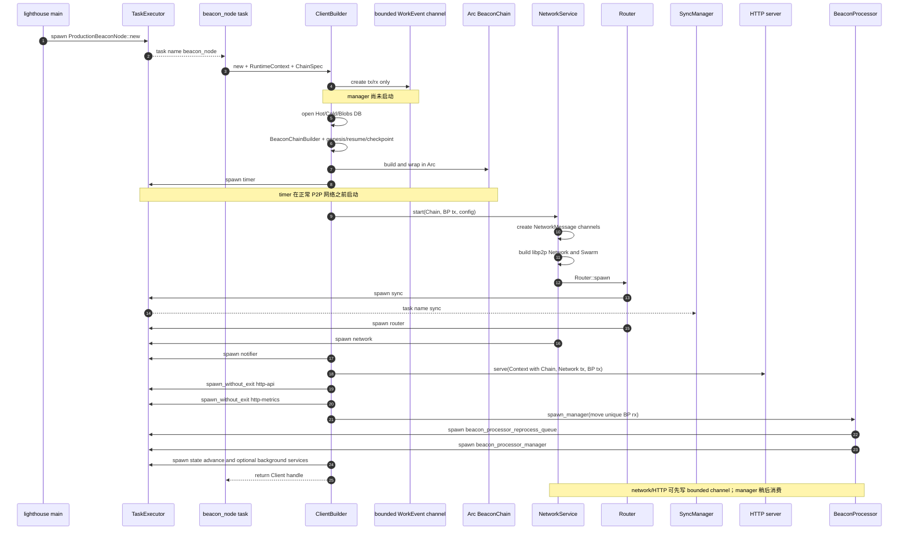

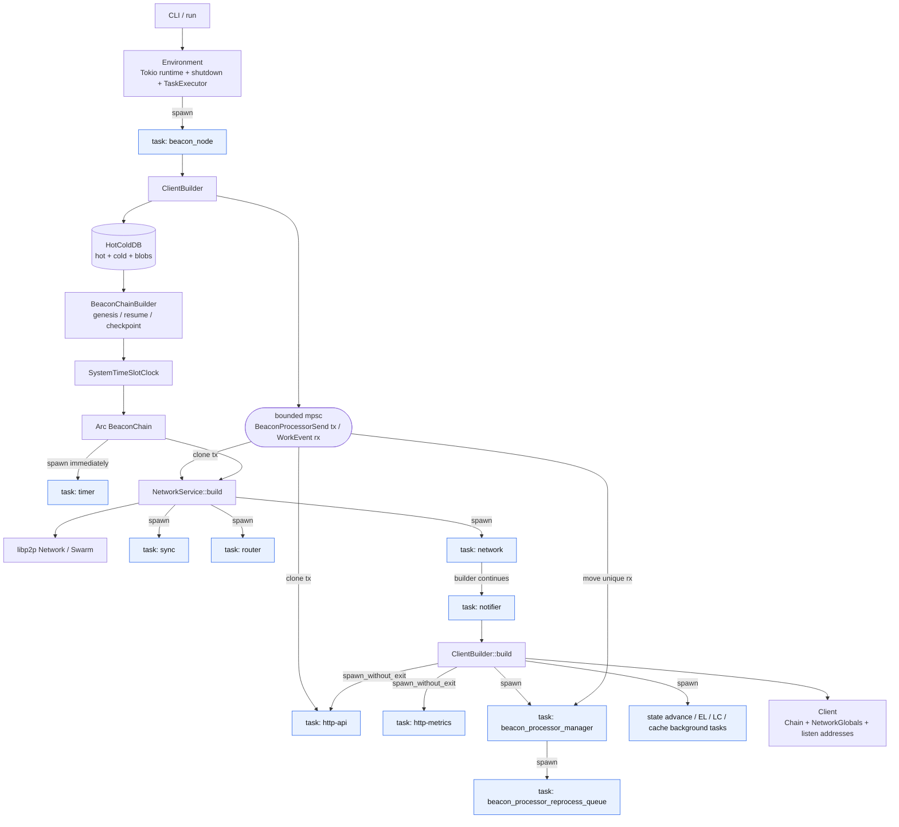

结构性结论：

- 正常的 `ClientBuilder::network()` 明确要求 `Arc<BeaconChain>` 已存在；当前完整 `NetworkService + Router + Sync + NetworkBeaconProcessor` 不是 pre-chain 网络。
- `NetworkService` 获得的是 `BeaconProcessorSend` 的 clone；它不创建、也不拥有 BeaconProcessor manager。
- `Client` 最终不保存这些 task 的 `JoinHandle`。退出和 panic 监控统一归 `TaskExecutor`/`Environment` 管理；普通 `TaskExecutor::spawn` 背后还会建立 monitor future，图中没有逐个展开。

### 3. 完整运行期数据面

下面把 P2P、HTTP、同步、调度和 `BeaconChain` 放在一起。channel 被画成独立实体，以明确 sender 与 receiver 的所有权。

```mermaid
flowchart LR
    PEER["remote peer"]
    HC["HTTP client"]

    subgraph LP["libp2p：由 Swarm poll 驱动，不是 Lighthouse mpsc"]
        TRANSPORT["TCP / QUIC<br/>Noise + Yamux"]
        SWARM["Swarm Behaviour<br/>Gossipsub + Eth2 RPC + Discovery<br/>Identify + PeerManager"]
        LOW["lighthouse_network::Network<br/>next_event"]
        TRANSPORT --> SWARM --> LOW
    end

    subgraph NT["spawned network-side tasks"]
        NET["task: network<br/>outer tokio::select!"]
        ROUTER["task: router<br/>serial for_each"]
        SYNC["task: sync<br/>SyncManager select!"]
        NBP["Arc NetworkBeaconProcessor<br/>Work adapter + three senders"]
    end

    subgraph HT["spawned HTTP side"]
        HTTP["task: http-api<br/>Axum/Hyper poll"]
        ROUTE["Warp route / handler future"]
        HTS["HTTP TaskSpawner<br/>blocking or async wrapper"]
        WAIT["request future<br/>await oneshot rx"]
        HTTP --> ROUTE --> HTS
        ROUTE --> WAIT
    end

    CH_ROUTER(["unbounded mpsc RouterMessage<br/>router_send / handler_recv"])
    CH_SYNC(["unbounded mpsc SyncMessage<br/>sync_send / sync_recv"])
    CH_NET(["unbounded mpsc NetworkMessage<br/>network_send / network_recv"])
    CH_BP(["bounded mpsc WorkEvent<br/>BeaconProcessorSend / event_rx"])
    CH_HTTP(["per-request oneshot result<br/>worker tx / HTTP rx"])

    subgraph BPT["BeaconProcessor"]
        BPM["task: beacon_processor_manager<br/>worker budget + typed queues"]
        BPR["task: beacon_processor_reprocess_queue<br/>delay/dependency scheduler"]
        WORKER["ephemeral task: beacon_processor_worker<br/>async / blocking / low-priority Rayon"]
    end

    subgraph STATE["shared consensus state"]
        CHAIN["Arc BeaconChain"]
        FC["canonical head / fork choice<br/>operation pools + caches"]
        DB[("HotColdDB<br/>blocks + states + blobs/columns")]
        EL["Execution Layer"]
        SSE(["Tokio broadcast<br/>SSE EventKind"])
        LC(["futures mpsc<br/>LightClientProducerEvent"])
        CHAIN --> FC
        CHAIN --> DB
        CHAIN --> EL
        CHAIN --> SSE
        CHAIN --> LC
    end

    BG["timer + state advance + EL/cache services"]

    PEER --> TRANSPORT
    LOW -->|"direct await returns NetworkEvent"| NET
    NET -->|"send"| CH_ROUTER -->|"recv"| ROUTER
    ROUTER -->|"gossip / provider RPC"| NBP
    ROUTER -->|"sync response / peer state"| CH_SYNC -->|"recv"| SYNC
    SYNC -->|"direct call: wrap RpcBlock / ChainSegment"| NBP

    NBP -->|"try_send WorkEvent"| CH_BP
    HTS -->|"try_send ApiRequest P0/P1"| CH_BP
    CH_BP -->|"custom poll event_rx"| BPM
    BPM -->|"spawn per Work"| WORKER
    BPM <--> BPR

    WORKER -.->|"captured Arc"| CHAIN
    NBP -.->|"Arc"| CHAIN
    ROUTER -.->|"Arc"| CHAIN
    SYNC -.->|"Arc"| CHAIN
    ROUTE -.->|"Arc"| CHAIN
    BG -.->|"Arc"| CHAIN

    WORKER -->|"HTTP result"| CH_HTTP --> WAIT
    WAIT --> HTTP --> HC

    WORKER -->|"RPC response / gossip validation / publish"| CH_NET
    NBP -->|"NetworkMessage"| CH_NET
    SYNC -->|"SendRequest"| CH_NET
    ROUTE -->|"HTTP network-control/publish route"| CH_NET
    CH_NET -->|"network_recv in select!"| NET
    NET -->|"direct call: send/publish/report validation"| LOW
    SWARM --> TRANSPORT --> PEER

    SSE -->|"subscribe"| HTTP
    LC --> LC_TASK["task: lc_update"]

    classDef task fill:#e8f1ff,stroke:#2563eb,color:#111;
    classDef worker fill:#fff4cc,stroke:#b7791f,color:#111;
    classDef channel fill:#ecfdf5,stroke:#059669,color:#111;
    class NET,ROUTER,SYNC,HTTP,BPM,BPR,BG,LC_TASK task;
    class WORKER worker;
    class CH_ROUTER,CH_SYNC,CH_NET,CH_BP,CH_HTTP,SSE,LC channel;
```

| 流量 | 路径 | 是否通常修改 `BeaconChain` |
| --- | --- | --- |
| Gossip block | libp2p → network → Router → NBP → BP worker → `process_block` | 是 |
| RPC client/sync response | libp2p → Router → SyncManager → NBP → `RpcBlock/ChainSegment` worker | 是 |
| 入站 provider RPC request | libp2p → Router → NBP → worker → 读 chain/store → `NetworkMessage::SendResponse` | 通常否 |
| HTTP publish block | HTTP TaskSpawner → `ApiRequestP0` worker → `process_block`，并可发 `NetworkMessage::Publish` | 是 |
| HTTP GET/query | HTTP TaskSpawner → worker → 读 chain/store → oneshot response | 通常否 |
| Ping/Metadata/部分内部 RPC | RPC Behaviour/Network 内部处理 | 否，且可能不上送 Router |

### 4. P2P 的两层 event polling

`NetworkEvent` 不是 channel 消息。它是底层 `Network::next_event()` 在同一个 `network` task 中被 await 后直接返回的值。第一个真正跨 Lighthouse task 的入站 channel 是 `RouterMessage`。

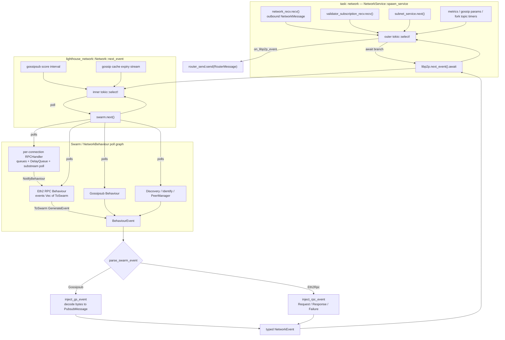

RPC 入站细节：

```text
raw substream
  → protocol negotiation
  → SSZ/Snappy codec + Framed stream
  → RequestType/Response
  → RPCHandler event
  → RPC Behaviour ToSwarm event
  → SwarmEvent::Behaviour(Eth2Rpc)
  → inject_rpc_event
  → NetworkEvent
```

`RPCHandler` 是由 Swarm 持有和 poll 的 per-connection handler，不是 Lighthouse 显式 spawn 的独立 Tokio task。libp2p 要求 executor 执行的内部 future，才会通过适配器以任务名 `libp2p` 提交到 `TaskExecutor`。

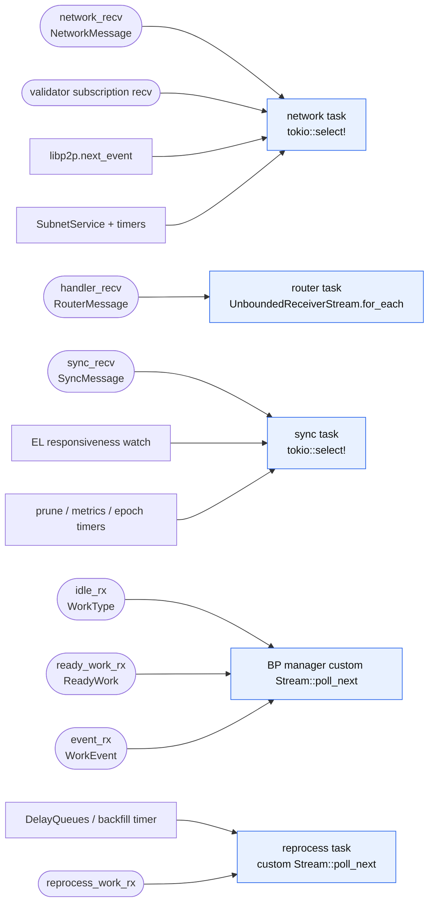

### 5. Router、Sync 和 NetworkBeaconProcessor 的边界

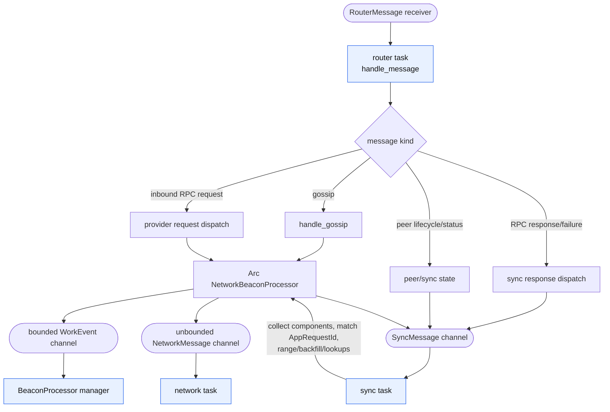

`NetworkBeaconProcessor` 不是常驻 processor task，而是共享 adapter。它主要持有 `BeaconProcessorSend`、`network_tx`、`sync_tx`、`Arc<BeaconChain>` 和 `TaskExecutor`，捕获这些依赖后，把业务函数封装成具体 `Work`。

RPC response 的同步路径不是 `Router → BeaconProcessor` 直达，而是：

```text
Router
  → SyncMessage::RpcBlock/RpcBlob/...
  → SyncManager 匹配 request、收集 components、组成 lookup 或 chain segment
  → NetworkBeaconProcessor 包装 Work::RpcBlock / Work::ChainSegment
  → BeaconProcessor worker 导入
  → SyncMessage::BlockComponentProcessed / BatchProcessed
  → SyncManager 更新同步状态
```

### 6. BeaconProcessor：task 包装、排队和 worker 生命周期

`BlockingFn` 只是 `Box<dyn FnOnce()>` 类型；它的具体实现就是 producer 捕获上下文后创建的 closure。HTTP `TaskSpawner` 和 `NetworkBeaconProcessor` 创建 closure/future，BeaconProcessor 只负责在合适的执行器上调用它。

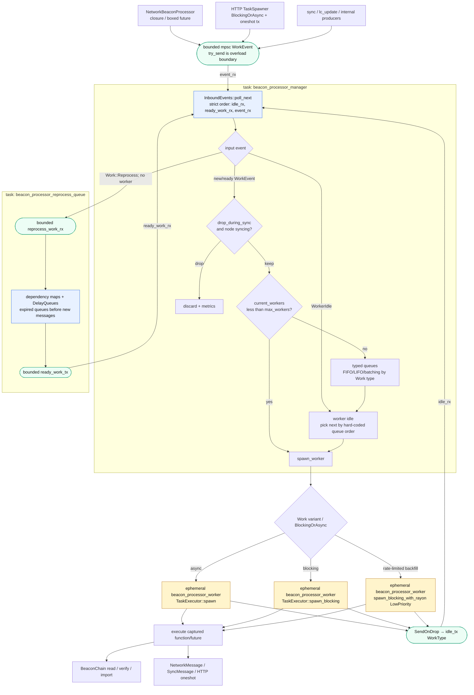

调度语义：

1. 没有固定的 “gossip worker” 或 “HTTP worker”。每取出一份 `Work`，manager 都临时 spawn 一个同名 `beacon_processor_worker` task。
2. `max_workers` 是逻辑并发预算，不等于固定 OS 线程池大小。
3. 新事件到达时若有 worker slot，通常立即 spawn；没有 slot 时才进入类型队列。因此“优先级”主要影响积压任务在 worker 释放后的取出顺序。
4. P0 是高优先级 API，但不是全系统最高；它位于 block/RPC block/DA 等关键工作之后、attestation 之前。P1 位于大多数重要网络和共识工作之后。
5. manager 固定优先 poll `idle_rx → ready_work_rx → event_rx`，避免持续新流量饿死已排队或已到期任务。
6. `SendOnDrop` 使 worker 在正常完成、提前 return，乃至 panic unwind 时都尽量归还逻辑 worker slot。

积压后的高层取队列顺序可概括为：

```text
chain segments
  → requested RPC blocks/blobs/columns/envelopes
  → delayed block/envelope
  → gossip block/payload/data availability/reconstruction
  → API P0
  → aggregates and attestations
  → sync committee / unknown-block reprocessing work
  → Status and inbound provider RPC work
  → slashings/exits/address changes
  → API P1
  → backfill
  → light-client gossip/provider work
```

这是便于理解的分组；精确的逐 variant 顺序以 `BeaconProcessor::spawn_manager` 中的 queue `pop()` 链为准。

### 7. Gossip block：从 peer 到数据库的完整闭环

这条时序中特别要注意：gossipsub 的 `Accept/Reject` 回执发生在 gossip 验证之后、完整 block import 之前。网络传播判定和本地完整导入不是同一个完成点。

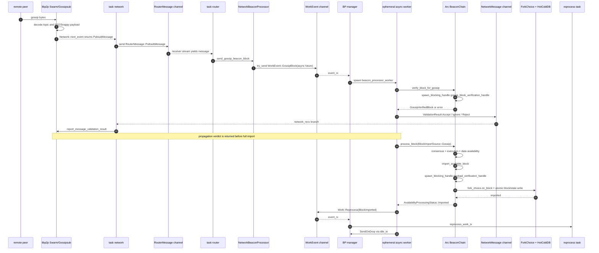

如果缺父块、blob/data column 或 execution payload component，流程会分叉到 `SyncMessage`/reprocess，而不是直接成功写库。组件被同步回来后，再由 `SyncManager → NetworkBeaconProcessor → Work::RpcBlock/ChainSegment` 回到同一调度与导入入口。

#### RPC provider 与 RPC sync 是方向相反的两条链

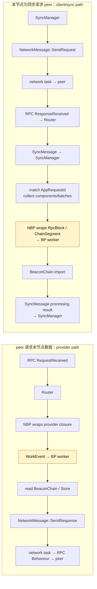

provider path 一般是读链并返回，不等于修改 `BeaconChain`；consumer/sync path 收到的是本节点主动请求的数据，经过同步状态机组装后才进入导入任务。

### 8. HTTP：请求结果与 worker-idle 是两条独立回路

以 `POST /eth/v1/beacon/blocks` 为会修改状态的例子：

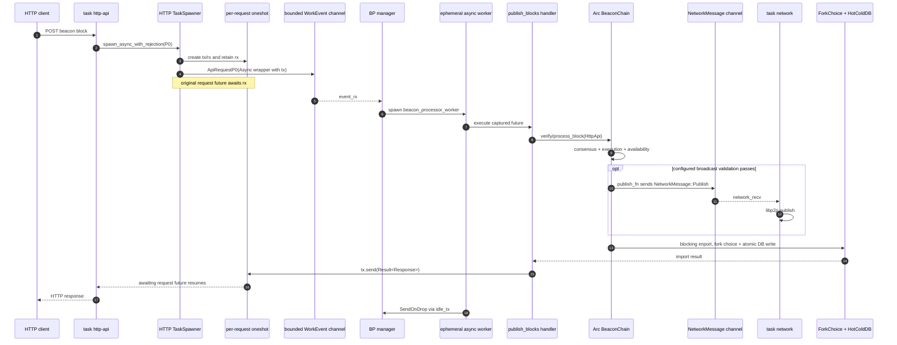

具体广播相对导入的时点受 `BroadcastValidation` 和 data-column 路径影响；它始终通过 `NetworkMessage` 出站总线，与 HTTP response 的 oneshot 回路分离。

HTTP 的两条回路不能混为一谈：

- **业务结果回路**：worker 中的 handler → per-request `oneshot::Sender` → 原 HTTP request future；不经过 Router 或 NetworkService。
- **worker 生命周期回路**：worker 完成 → `SendOnDrop` → bounded `idle_tx` → manager；不携带 HTTP 业务结果。

blocking HTTP handler 的包装方式：

```text
closure: FnOnce() -> Result<T>
  → wrapper closure 执行后 oneshot tx.send(result)
  → BlockingOrAsync::Blocking(Box<dyn FnOnce()>)
  → Work::ApiRequestP0/P1
```

async HTTP handler 的包装方式：

```text
Future<Output = Result<Response>>
  → wrapper future 执行后 oneshot tx.send(result)
  → BlockingOrAsync::Async(Pin<Box<dyn Future>>)
  → Work::ApiRequestP0/P1
```

HTTP 并非所有路由都进入 BeaconProcessor：部分网络控制路由可直接使用 `NetworkSenders`；已经调度到 worker 的发布 handler 也可另发 `NetworkMessage`；SSE route 则订阅 broadcast receiver。昂贵的 chain handler 才使用 HTTP `TaskSpawner` 做 P0/P1 调度。

### 9. BeaconChain 的实际修改边界与输出

网络请求本身不直接改状态；真正的提交点在 `BeaconChain::import_block`。它更新 fork choice，并把 block/state 等 `StoreOp` 原子写入数据库；只有 fork choice 和 DB 都知道该 block 后，才把它视为 imported。

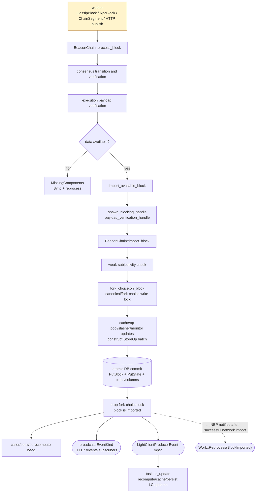

补充边界：`Work::Reprocess(BlockImported)` 不是 `BeaconChain::import_block` 自己自动发出；当前网络导入路径由 `NetworkBeaconProcessor` 在成功后通过同一个 BeaconProcessor sender 发回。纯 HTTP block import 路径不应被假设为天然产生同样的通知。

### 10. Channel、sender、receiver 和背压总表

| 连接 | 类型 / 容量 | 主要 sender 持有者 | 唯一或主要 receiver / poll 点 | 背压语义 |
| --- | --- | --- | --- | --- |
| 上层 → BeaconProcessor | bounded Tokio `mpsc<WorkEvent>`；`max_work_event_queue_len` | `NetworkBeaconProcessor`、HTTP `TaskSpawner`、LC/internal producers | BP manager 的 `event_rx.poll_recv` | `try_send`；满时显式 overload/drop，是主要业务背压边界 |
| 上层 → NetworkService | unbounded Tokio `mpsc<NetworkMessage>` | Router/Handler context、NBP、Sync context、HTTP 等 | `network` task 的 `network_recv.recv()` select 分支 | 无 channel 容量背压，应依赖上游控制 |
| Validator subscription → NetworkService | bounded Tokio mpsc，容量 65,536 | HTTP/validator-facing caller | `validator_subscription_recv.recv()` | 有界 |
| NetworkService → Router | unbounded Tokio `mpsc<RouterMessage>` | `NetworkService.router_send` | `router` task 的 `UnboundedReceiverStream::for_each` | Router 串行消费，无容量背压 |
| Router/NBP → SyncManager | unbounded Tokio `mpsc<SyncMessage>` | Router、NBP worker | `sync` task 的 `input_channel.recv()` select 分支 | 无 channel 容量背压 |
| worker → BP manager | bounded Tokio `mpsc<WorkType>` | 每个 worker 的 `SendOnDrop` | manager 的 `idle_rx.poll_recv`，最高 polling 优先级 | 归还逻辑 worker slot |
| manager → reprocess scheduler | bounded Tokio `mpsc<ReprocessQueueMessage>`；`max_scheduled_work_queue_len` | BP manager | reprocess task 的 `work_reprocessing_rx.poll_recv` | scheduler 先 poll 到期项，再 poll 新消息 |
| reprocess scheduler → manager | bounded Tokio `mpsc<ReadyWork>`；同上 | reprocess task | manager 的 `ready_work_rx.poll_recv`，高于新事件 | 到期/依赖满足后重新进入正常调度 |
| HTTP worker → HTTP request | Tokio `oneshot<T>`；每请求一个 | 捕获在 closure/future 中的 tx | 原 request future await rx | 单次业务返回，不参与 worker slot 管理 |
| BeaconChain → SSE | Tokio `broadcast<EventKind>`；默认 `16 × multiplier` | `ServerSentEventHandler` | 每个 `/events` subscriber 自有 receiver | 慢 subscriber 可 lag |
| BeaconChain → LC producer | bounded futures mpsc | `BeaconChain.light_client_server_tx` | `lc_update` task | 只为满足时效条件的近期 block 发送 |
| Environment shutdown | shutdown sender + clonable exit receiver | main/task panic/failure paths | TaskExecutor-wrapped tasks/server graceful shutdown | 统一生命周期控制 |

`NetworkMessage`、`RouterMessage`、`SyncMessage` 都是 unbounded，而 `WorkEvent` 是 bounded。系统最明确的计算负载保护发生在进入 BeaconProcessor 之前；未来新增昂贵 provider RPC 时，需要定义 queue full 如何回 RPC error，不能只记录日志。

### 11. Spawn 实体清单

| task 名称 | 生命周期 | 作用 / polling 方式 |
| --- | --- | --- |
| `beacon_node` | 启动期主 future | 执行 `ProductionBeaconNode::new` 和整个 builder 链 |
| `timer` | 长期 | sleep 到下一 slot，调用 `BeaconChain::per_slot_task` |
| `network` | 长期 | 外层 `tokio::select!`，拥有 `NetworkService` 与底层 `Network/Swarm` |
| `router` | 长期 | 串行消费 `RouterMessage` 并按语义分流 |
| `sync` | 长期 | poll `SyncMessage`、EL 状态与维护 timers，管理 range/backfill/lookups |
| `notifier` | 长期 | 周期输出同步/节点状态 |
| `http-api` | 长期，`spawn_without_exit` | Axum/Hyper server future 驱动 accept/request polling |
| `http-metrics` | 长期，`spawn_without_exit` | metrics server |
| `beacon_processor_manager` | 长期 | poll 三个输入 receiver，维护并发预算和类型队列 |
| `beacon_processor_reprocess_queue` | 长期 | poll DelayQueue/依赖映射与 reprocess receiver |
| `beacon_processor_worker` | **每份 Work 临时创建** | 根据 variant 运行 async、Tokio blocking 或低优先级 Rayon work |
| `libp2p` | 动态/内部 | libp2p 通过适配器提交给统一 `TaskExecutor` 的 future |
| `gossip_block_verification_handle` | 每次验证临时创建 | 将同步 gossip block 验证放到 Tokio blocking pool |
| `payload_verification_handle` | 每次可导入 block 临时创建 | 在 blocking context 执行最终 `import_block` |
| `fetch_blobs_gossip` | 条件性临时 | gossip block 旁路获取/发布 data components |
| `state_advance_timer` 及其派生 task | 长期 + 临时 | 提前构造 state、推进 fork choice |
| `lc_update` | 可选长期 | 消费 LC producer channel，计算并缓存/持久化 updates |
| EL watchdog/cleanup、proposer prep、availability/cache services | 条件性长期 | 运行期维护任务 |

这里的“特定 worker”应理解成“manager 根据 `Work` variant 选择队列和执行方式后，临时 spawn 的 task”，而不是预先常驻、永久绑定某种请求类型的 worker 线程。

### 12. 关键源码入口与当前笔记修正

- Client 启动：[beacon_node/src/lib.rs](../beacon_node/src/lib.rs)、[client/src/builder.rs](../beacon_node/client/src/builder.rs)
- TaskExecutor：[common/task_executor/src/lib.rs](../common/task_executor/src/lib.rs)
- NetworkService 与 channel：[network/src/service.rs](../beacon_node/network/src/service.rs)
- Router：[network/src/router.rs](../beacon_node/network/src/router.rs)
- SyncManager：[network/src/sync/manager.rs](../beacon_node/network/src/sync/manager.rs)
- libp2p Network polling：[lighthouse_network/src/service/mod.rs](../beacon_node/lighthouse_network/src/service/mod.rs)
- RPC protocol/handler：[rpc/protocol.rs](../beacon_node/lighthouse_network/src/rpc/protocol.rs)、[rpc/handler.rs](../beacon_node/lighthouse_network/src/rpc/handler.rs)
- NetworkBeaconProcessor：[network_beacon_processor/mod.rs](../beacon_node/network/src/network_beacon_processor/mod.rs)
- BeaconProcessor：[beacon_processor/src/lib.rs](../beacon_node/beacon_processor/src/lib.rs)
- reprocess scheduler：[work_reprocessing_queue.rs](../beacon_node/beacon_processor/src/scheduler/work_reprocessing_queue.rs)
- HTTP task wrapper：[http_api/src/task_spawner.rs](../beacon_node/http_api/src/task_spawner.rs)
- BeaconChain import：[beacon_chain/src/beacon_chain.rs](../beacon_node/beacon_chain/src/beacon_chain.rs)

阅读前面摘录时，以当前源码和本节为准，尤其注意这些变化：

1. BeaconProcessor 注释可能仍称 worker 都经 `spawn_blocking`，实际 match 已同时使用 async、blocking 和 low-priority Rayon。
2. `Work::GossipBlock` 当前包含 boxed async future；`BlockingFn`/`AsyncFn` 都只是 producer 构造的可执行值。
3. `Work::Reprocess` 不作为普通 worker 立即执行；manager 把内部 message 交给专门 scheduler，ready 后再回 manager。
4. `NetworkEvent` 是 `Network::next_event()` 的直接返回值，不存在 `NetworkEvent sender/receiver`。
5. Router 当前用 `UnboundedReceiverStream(handler_recv).for_each(...)` 串行 dispatch。
6. 正常高层 `NetworkService` 依赖 `BeaconChain`；若设计 pre-chain P2P，应拆出最小 bootstrap transport/controller，而不是直接提前启动现有 Router/Sync/NBP 整套结构。
